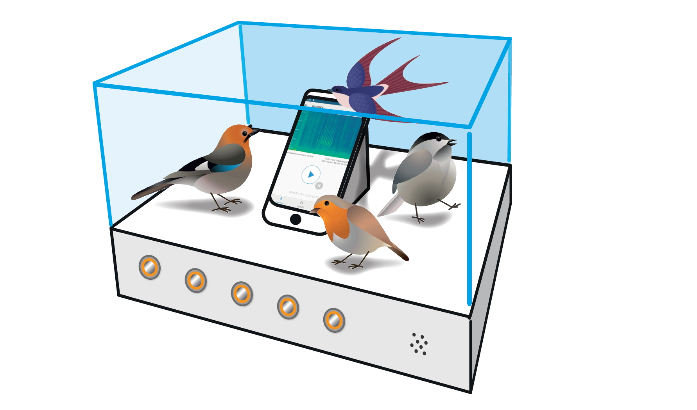

# BirdNET-Demo
Source code for BMBF InnoTruck demo of BirdNET.



Author: Stefan Kahl

Contact: stefan.kahl@cs.tu-chemnitz.de

Website: https://birdnet.cornell.edu/

Please cite as (PDF coming soon):

```
@phdthesis{kahl2019identifying,
  title={{Identifying Birds by Sound: Large-scale Acoustic Event Recognition for Avian Activity Monitoring}},
  author={Kahl, Stefan},
  year={2019},
  school={Chemnitz University of Technology}
}
```

## Setup Raspberry Pi (Raspian Buster)

Clone the repository:

```
git clone https://github.com/kahst/BirdNET-Demo.git
```

Install dependencies (you'll need to install Python3 and pip3 if not already provided with the OS image):

```
sudo pip3 install RPi.GPIO
```

Start playback script after startup by adding this line to <i>/etc/rc.local</i> (before exit 0):

```
cd /home/pi/BirdNET-Demo && python3 pi/playback.py &
```

Change the path to <i>BirdNET-Demo</i> accordingly if you used a different location. After reboot, the script will start automatically and play sounds when a button is pressed.

The script uses the following GPIO pins to play sounds:

```

Pin 11 GPIO.17: Common Starling (Sturnus vulgaris)
Pin 12 GPIO.18: Common House-Martin (Delichon urbicum)
Pin 13 GPIO.27: Common Linnet (Linaria cannabina)
Pin 15 GPIO.22: European Pied Flycatcher (Ficedula hypoleuca)

Pin 18 GPIO.23: Random species (Goldcrest, Yellowhammer, Eurasian Blue Tit, Common Chiffchaff, European Goldfinch)

```

All sounds provided by Xeno-canto (www.xeno-canto.org).


Recordists: Marc Andreso, Lauri Hallikaine, Lars Edeniu, Jordi Calve, Veljo Runne, Elisa A. Ryber, Peter Boesma, Jorge Leitão, Karl-Birger Stran, Hans Mathev

## Setup Intel NUC (Ubuntu 18.04)

Clone the repository:

```
git clone https://github.com/kahst/BirdNET-Demo.git
```

Install Python 3 and pip:

```
sudo apt update
sudo apt install python3-dev python3-pip
sudo pip3 install --upgrade pip
```

Install TensorFlow:

```
sudo pip3 install tensorflow
```

Install other Python 3 dependencies:

```
sudo apt-get install python3-numpy python3-scipy
```

Install Python 2.7 and pip:

```
sudo apt install python2.7 python-pip
sudo pip install --upgrade pip
```

Install other Python 2.7 dependencies:

```
sudo apt install portaudio19-dev python-pyaudio
sudo pip install bottle paste pyaudio
```

Install Chromium Browser:

```
sudo apt install chromium-browser
```

## Start demo automatically

To start the demo after reboot, we need to add the startup script from this repository to the desktop autostart by creating a custom autostart entry with:

```
cd ~/.config/autostart/
sudo nano birdnet-startup.desktop
```

Add the following content the startup file:

```
[Desktop Entry]
Type=Application
Exec=gnome-terminal --command "/home/birdnet/BirdNET-Demo/startup.sh"
X-GNOME-Autostart-enabled=true
Name=BirdNET Startup Script
```

Save the contents and close the editor. Both, this entry and the startup.sh, assume that the demo resides in <i>/home/birdnet/Birdnet-Demo</i>. If this is not the case, make sure to change both files accordingly. 

The startup script in this repository needs to be executable, we can change that with:

```
cd /home/birdnet/BirdNET-Demo
sudo chmod +x startup.sh 
```

Additionally, we need to automatically log in on startup. We can achieve that by altering <i>custom.conf</i> with:

```
sudo nano /etc/gdm3/custom.conf
```

We need to change 

```
# Enabling automatic login
#  AutomaticLoginEnable = true
#  AutomaticLogin = user1
```

to

```
# Enabling automatic login
  AutomaticLoginEnable = true
  AutomaticLogin = yourusername
```

Make sure to enter the correct username instead of <i>yourusername</i>.

After reboot, Ubuntu should launch the demo automatically.

## Start demo manually

Open terminal window and launch analyzer in Python 3:

```
python3 analyzer.py
```

Open another terminal window or tab (Ctrl-Shift-T) and launch streaming server in Python 2:

```
python server.py
```

Launch Chromium browser in kiosk mode with auto play enabled and navigate to the demo website to view audio and analysis data:

```
chromium-browser --kiosk --autoplay-policy=no-user-gesture-required --incognito --password-store=basic --app=http://localhost:8080
```

